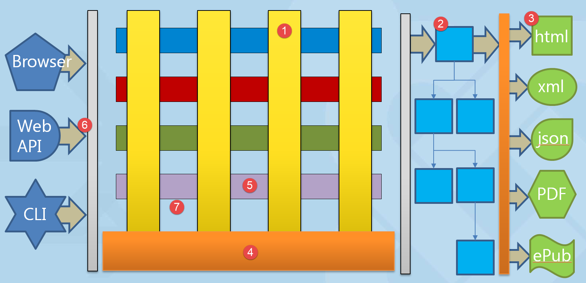

# CDH Milestone

Showcase JoomlaX with basic **article** component __[1]__.
The showcase is to  serve as the proof of concept  for the JoomlaX (see note) architecture.
The proof of concept is meant as an educational example, to show the workings, discuss and build upon.
The core architecture is NOT imposed on anybody other than developers contributing to core.
A compatibility layer is envisioned that will encapsulate/shield the core.
The compatibility layer will ensure that extensions should not have to change and suffer BC in a major way.
The compatibility layer is NOT part of the CDH.
Ultimately we would encourage developers to migrate over but in this major version it is not a requirement.

The concept will cover 

  * Universal Content Types
  * Rendering 
  * Storage
  * Workflow
  * Command Bus
 
As a reference we use the basic architecture picture as shared previously

Do note that the repository is in an embryonic stage as of beginning of march and is in no way representative of the milestone result

## [2] Universal Content Types (UCT)

Abstract/semantic definitions of content where UCT ultimately are combined into a Content Tree to be rendered by an arbitrary renderer outputting based on HTML, JSON etc.
The majority of UCTs will be defined by the UX working group. 
For CDH milestone purposes a limited number (2 to 4) of UCTs will be defined by ARCH to show the working of the renderer.
Any additional items available from UX team are considered a bonus

## [3] Renderer

Render the Content tree (CT) with a limited number of UCTs.

For the CDH milestone, renderers for plain HTML (without JS, but with with basic support of layouts), JSON, and plain text will be provided.
The plain HTML renderer can serve as a base for people with more JS skills.

## [4] Storage 

Storing content is handled as a two staged incremental development approach
The CQRS storage aspects are dealt with different Persistors and Lookup methods.

### CSV files

Outset for experimenting and getting started.

### Database

System glue to storage layer. Doctrine DBAL.
These could facilitate different types of storage engines for read and write based upon the DBAL.
 
## [5] Workflow

Workflow is choosen as an example for the horizontal component, showcasing the different states being offered to "article" vertical

  * Published
  * UnPublished
  * Archived
  * Trashed

The article component as vertical will "get" the horizontals functionality automatically. 

## [6] Channel Independancy Border

The CDH milestone will show how to access the "article" component from different channels

  * Browser (`index.php`), using the HTML renderer
  * Web API (`api.php`), using the JSON renderer
  * CLI (`joomla.php`), using the plain text renderer

## Command / Query Bus

Chris Davenport's [Service Layer](https://github.com/chrisdavenport/service) is used to provide a CommandBus and a QueryBus,
based on Tactician.

## Event system

There will be various events triggered during a request. What will be the equivalent of the JPluign in JoomlaX and how can an extension itself hook into the event system. This will be shown with an example.

#NOTE

  * The term *ORM* is the best approximation of intended functionality.
    In this example, ORM does not mean a full fledged ORM as we might know it.

  * JoomlaX is used instead of Joomla4 because there might be a need to promote a member of the Joomla 3.x series to J4
    as an intermediate step,
    because it may be desired to do so in light of backward compatibility break for PHP version, removal of deprecated code or other.
